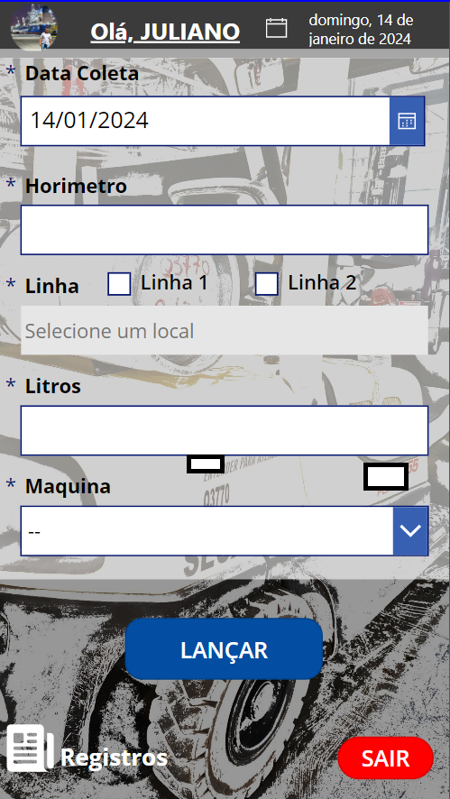
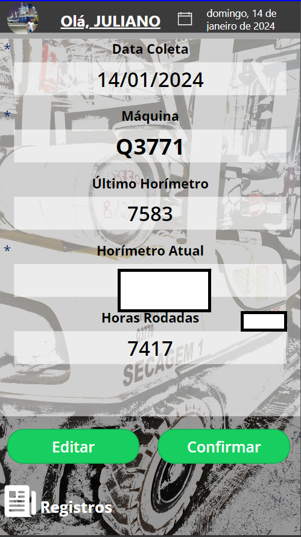
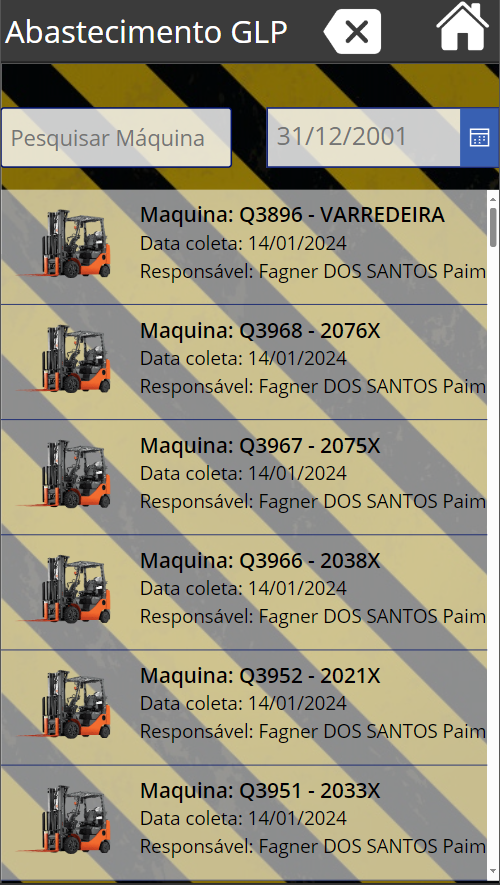

# PowerApps - Gestão de Abastecimento GLP

## Visão Geral

O aplicativo de Gestão de Abastecimento GLP, desenvolvido no PowerApps, oferece uma solução eficaz para o registro do consumo de gás em equipamentos durante o período entre abastecimentos. Esse aplicativo é projetado para facilitar o trabalho dos frentistas, permitindo o acompanhamento preciso do consumo de GLP de cada equipamento e o cálculo do consumo médio.

## Observações Importantes

Para uma utilização eficiente do aplicativo, leve em consideração as seguintes observações:

- **Conexão com Banco de Dados:**
  - Configurar uma conexão com um banco de dados é essencial para armazenar informações sobre o consumo de gás de cada equipamento. Certifique-se de ajustar as configurações antes de começar a utilizar o aplicativo.

- **Requisitos de Acesso:**
  - Faça login com as credenciais fornecidas pela equipe de TI para garantir a segurança e integridade dos dados.

## Funcionalidades Principais

1. **Registro de Consumo de GLP:**
   - Permite aos frentistas registrar o consumo de gás de cada equipamento entre os abastecimentos.

2. **Acompanhamento do Consumo Médio:**
   - Facilita o cálculo do consumo médio de cada equipamento, fornecendo dados essenciais para otimização e planejamento.

3. **Alertas de Abastecimento:**
   - Receba notificações sobre equipamentos que estão se aproximando do limite de consumo para um melhor gerenciamento.

## Como Usar

1. **Login:**
   - Faça login utilizando as credenciais fornecidas pela equipe de TI.

2. **Registro de Consumo:**
   - Registre o consumo de gás de cada equipamento durante o intervalo entre abastecimentos.

3. **Cálculo de Consumo Médio:**
   - Utilize as funcionalidades do aplicativo para calcular o consumo médio de cada equipamento.

4. **Alertas de Abastecimento:**
   - Esteja atento às notificações para abastecer equipamentos que estão se aproximando do limite de consumo.

## Requisitos do Sistema

- Navegador da web moderno
- Conexão com a internet para atualizações em tempo real
- Credenciais fornecidas pela equipe de TI para acesso

## Capturas de Tela

>Home\

>Registros\

>Historio\
